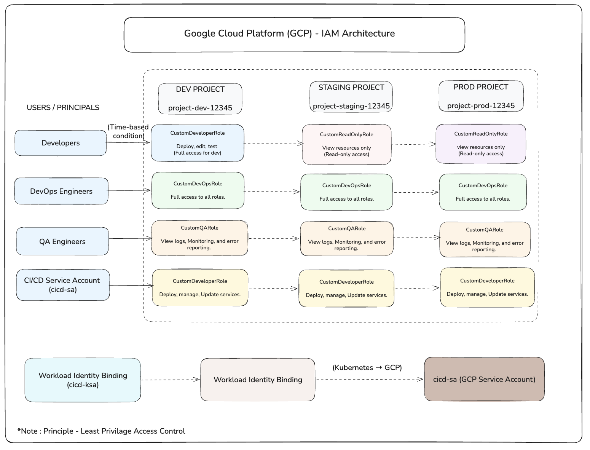

#  IAM Architecture Design using Google Cloud Platform (GCP)

##  Project Overview

This project demonstrates the design and implementation of a secure and scalable **Identity and Access Management (IAM)** architecture in Google Cloud Platform (GCP).

The solution follows industry best practices including:

* Custom IAM roles
* Least privilege principle
* Environment isolation
* Infrastructure as Code (Terraform)

---

##  Architecture Summary

The system is divided into three separate environments:

* **Development (Dev)** -> `project-dev-12345`
* **Staging** -> `project-staging-12345`
* **Production (Prod)** -> `project-prod-12345`

Each environment is implemented as a **separate GCP project** to ensure strong isolation and security.

---

## User Roles & Access Design

###  Developers

* **Dev** -> Deploy access (`CustomDeveloperRole`)
* **Staging** -> Read-only (`CustomReadOnlyRole`)
* **Prod** -> Read-only (`CustomReadOnlyRole`)

---

###  DevOps Engineers

* Full access across all environments
  (`CustomDevOpsRole`)

---

###  QA Engineers

* View logs and monitoring only
  (`CustomQARole`)

---

###  CI/CD Service Account

* Deployment access across all environments
  (`CustomDeveloperRole`)

---

##  Custom IAM Roles

Custom roles were created instead of predefined roles to enforce strict access control.

| Role Name             | Description                             
| --------------------- | --------------------------------------- 
| `CustomDeveloperRole` | Deploy and manage application resources 
| `CustomDevOpsRole`    | Full control over infrastructure        
| `CustomQARole`        | Access to logs and monitoring           
| `CustomReadOnlyRole`  | Read-only access to resources           

---

##  Permissions Strategy

Permissions were carefully selected based on responsibilities:

* Developers -> Limited deployment access
* DevOps -> Full administrative control
* QA -> Logging and monitoring access
* ReadOnly -> View-only permissions

---

##  Principle: Least Privilege

This architecture strictly follows the **Principle of Least Privilege**, ensuring users only have the minimum access required to perform their tasks.

---

##  Service Account Usage

A **CI/CD service account** is used to automate deployments across all environments securely.

* Eliminates manual intervention
* Centralized deployment control
* Secure role-based access
---

##  Workload Identity Implementation

Workload Identity was implemented to enable secure, keyless authentication between workloads and Google Cloud services.

A binding was created between a Kubernetes service account and a GCP service account using the "Workload Identity User" role. This allows applications to securely access GCP resources without storing service account keys.

Example binding:
serviceAccount:project-dev-12345.svc.id.goog[default/cicd-ksa]  

---

##  IAM Conditions

IAM Conditions were implemented to enforce time-based access control.

A condition was added to restrict developer access to a specific time period, ensuring temporary and controlled permissions.

Example:
Access is allowed only until 31st December 2026.

Condition Expression:
request.time < timestamp("2026-12-31T23:59:59Z")

---

##  IAM Architecture Diagram



##  Infrastructure as Code (Terraform)

Terraform is used to manage IAM bindings and automate access control.

###  Project Structure

```
task1/
 |-- provider.tf
 |-- variables.tf
 |-- iam-dev.tf
 |-- iam-staging-prod.tf
 |-- README.md
```

---

###  How to Run

```
terraform init
terraform plan
```

> Note: `terraform apply` is not required if resources are already created manually.

---

## Conclusion

This project demonstrates a real-world IAM architecture using GCP with strong security practices, proper access control, and scalable design suitable for production environments.

---

 *This architecture ensures secure, controlled, and role-based access to cloud resources across all environments.*
